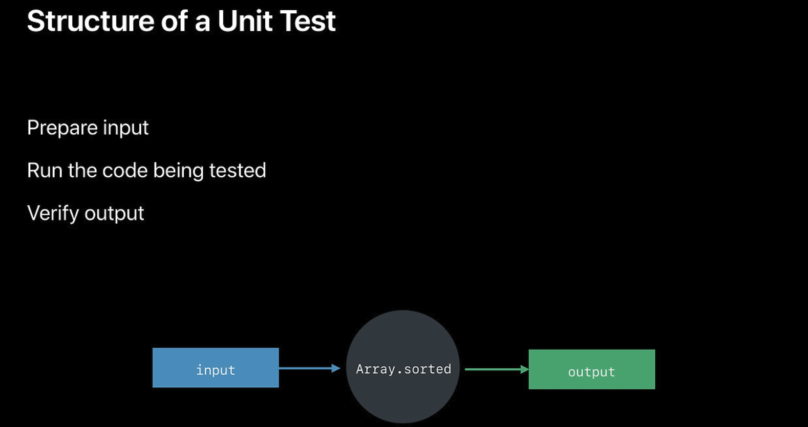

# Testability Techniques

- Structure of a Unit Test

  - input(Arrange)
  - test(Act)
  - output(Assert)
  
- Characteristics of Testable Code
  - Control over inputs
  - Visibility into outputs
  - No hidden state (코드의 동작에 영향을 줄 수 있는 내부 상태에 의존하지 않는다.)

## Protocols and parameterization
  - Reduce reference to share instances
  - Accept parameterized input
  - Introduce a protocol
  - Create a testing implementaion

## Separating logic and effects
  - Extract algorithms
  - Functional style with value types
  - Thin layer on top to execute effects