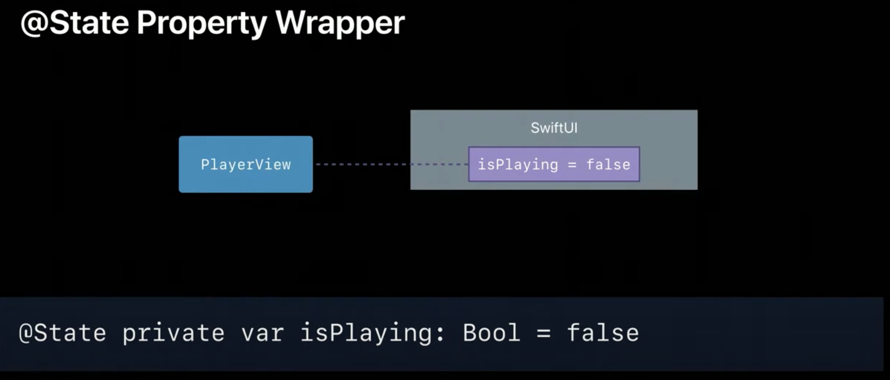

# Data Flow Througn SwiftUI

> Principles of Data Flow
> Anatomy of an Update 
> Understand Your Data

 

## Principles of Data Flow

### What is data
> Data is first class citizen in SwiftUI
  - 데이터는 UI를 구동시키는 모든 정보
  - ex. 토글의 상태, 메시지 목록을 구성하는 모델 데이터

 

### Two principles 

#### Data Access as a Dependency
  > Data가 변하면 View를 다시 그려야하는 종속성, 이전에는 수동으로 설정해줬어야함

  
  
#### Source of Truth
  > 단 1개의 Source of Truth 만 가져야한다. 상태가 불일치해 버그가 발생할 수 있다.

  
  

### Player UI

#### property
> read-only access

#### State

- property를 변경하려고 하면 compile error 발생
- 이것은 일부 뷰 body에서 다른 값을 만들어 낼 수 있습니다.(value type이라서 source of truth가 여러개 생긴다는건가??)

 

- isPlaying은 변할 수 있고 view가 의존한다고 system에게 말합니다.

 

- state를 사용하면 framework는 persistent storage를 할당하고 dependency로써 추적합니다.
- system은 storage를 만들기위해서 initial constant value가 필요합니다.
- view가 re create 해도 persistent storage는 유지됩니다.
- state를 private로 선언해 해당 view에서만 사용된다고 명시해주는것 추천

 
 

## Anatomy of an Update

- state가 바뀌면 view redering 함

- state가 바뀌면 view의 body와 자식들을 전부 recompute함(다시 그린다는건가?)
- 모든 변화는 view hirachy를 따라 flow down한다.
- 이것이 framework가 dependency를 관리해준다는 의미이다.

> **Every @State is a source of truth **

> Views are a function of state,
> not of a sequence of events.

- single direction
  - predictable, simple to understand

 

#### binding
> Read and Write without ownership
> Derrived from @State (초깃값 설정 안해줘도 됨)

- @State를 사용하면 새로운 Source of Truth 생성

- Toggle, Slider, TextField 들도 Binding을 갖고 있어 당신에게 source of truth를 통제할 수 있게해준다.

- withAnimation을 사용하면 애니메이션 쉽게 적용가능

 
 

## Working With External Data

### External Changes in SwiftUI
- timer, notification 같은 이벤트들은 외부에서 발생합니다.
- SwiftUI 에서 view는 function of state입니다.
  - 외부 event도 User Interaction처럼 같은 방식으로 처리됩니다.

- 이런 외부이벤트를 처리하기위해 publisher를 사용합니다.
- Combine은 시간이 흐름에서 data를 처리하기위한 선언형 API 입니다.
- SwiftUI와 publisher를 사용할 때는 main thread에서 emit 해야합니다.
  - receiveOn 연산자 사용

- onReceive 사용해 Publisher가 방출하는 event를 받아 클로저에서 처리해줍니다.
- state를 변경하면 자동으로 view 다시 그림

### External Data in SwiftUI

#### BindableObject Protocol
- External
- Reference type
- Great for the model you already have

 

> SwiftUI 단지 data의 변화에 어떻게 반응하면되는지만 필요합니다.

- SwiftUI는 didChange publisher를 구독해서 update 시점을 파악합니다.
- model 바뀔 때마다 해야함

#### Creating Dependencies on BindableObject

- @ObjectBinding

- @EnviromentObject
> Creating Dependencies Indirectly

- 여러곳에서 1개의 EnviromentObject 공유해서 사용가능

- ObjectBinding을 사용하면 앱 전체를 구성할 수 있지만 모델을 hop to hop 차례대로 전달해야돼 번거롭다.
- EviromentObject를 사용하면 간접적으로 전달해 줄 수 있다. 계층 구조를 무시하고 공유해 사용할 수 있다.

 
 

## Wrap Up

### Sources of Truth

### Building Reusable Componenets

- 성능은 항상 좋으니깐 아키텍처와 성능 사이 tradeoff 신경쓰지 마라

### @Binding

