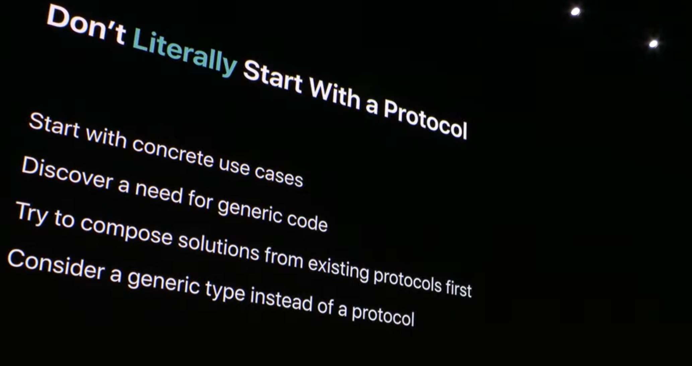
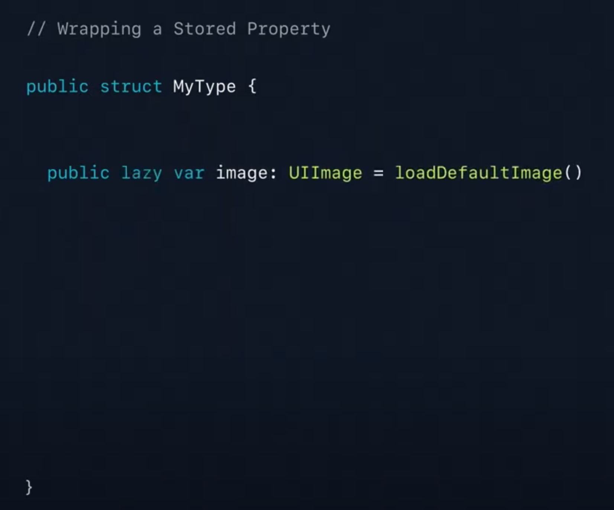
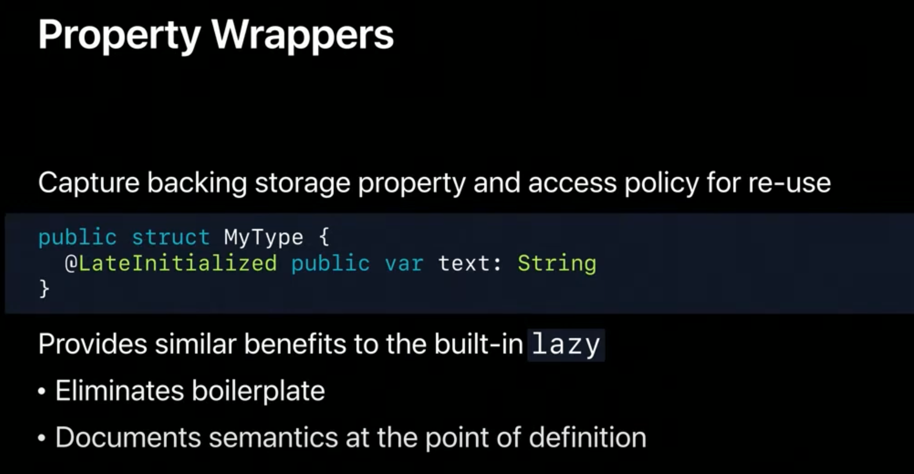

# Modern Swift API Design

## API Design Guidelines
> [API Design Guidelines🔗](https://www.swift.org/documentation/api-design-guidelines/) - Clarity at the point of use
 

### No Prefixes in Swift-only 

- C and Objective-C symbols are global
  - Objective-C 에서는 클래스 이름 충돌을 방지하기 위해 접두사(NS, UI)를 사용
  ```objective-c
  // LibraryA
  @interface Person : NSObject
  @end

  // LibraryB
  @interface Person : NSObject
  @end

  // 이 경우, LibraryA와 LibraryB 모두에서 Person 클래스를 정의하고 있기 때문에
  // 전역 네임스페이스에서 충돌이 발생합니다.

  ```

- Swift's module system allows disambiguation
    ```swift
  // ModuleA.swift
  public class MyClass {
    public init() {}
    public func greet() {
      print("Hello from ModuleA")
    }
  }

  // ModuleB.swift
  public class MyClass {
    public init() {}
    public func greet() {
      print("Hello from ModuleB")
    }
  }
  ```

  ```swift
  import ModuleA
  import ModuleB

  let classA = ModuleA.MyClass()
  let classB = ModuleB.MyClass()

  classA.greet()  // Hello from ModuleA
  classB.greet()  // Hello from ModuleB
  ```
- each source file brings its imports into the same namespace - Remember
  - A very general name will cause your users to have to manually disambiguate in the case of conflicts.
  - And always remember clarity at the point of use.
  - A general name from a specific framework can look a little bit confusing when you see it out of context.


<br>

- Values and references
- Protocols and generics
- Key path member lookup
- Property wrappers

## Values and references

### 3가지 타입 생성 방법 
> class, struct, enum

- Reference Types


- Value Types
  - Value Type을 사용하면 그 값이 어디에서 왔고 변경되지는 않을지 걱정하지 않아도 된다.


<br>

### Choosing - Reference or Value?


- Where there is a separate notion of "identity" from "equality"  
  - identity: 같은 메모리 영역을 가르키는지
  - equality: 같은 값을 갖는지

<br>


- Entity들은 realityKit engine 내부에 centrally 하게 저장됨
- identity를 갖음
- 물체의 모양을 바꾸거나 주변 장면을 조작하면 엔진에서 직접 물체를 조작한다.
- 따라서 reference 타입이 적당하다.
- entity 내부의 location, orientation 들은 value type입니다.

<br>

- API가 model 어떻게 동작하고 왜 동작하는지 쉽게 설명하는 것이 중요하다.  
  - 어떻게 동작하는지는 우연히 사고에 의해 발생되면 안된다.


- material은 value 타입이라 이전 코드에 영향을 미치지 않음
- 변경으로 인한 사고 방지 가능 


- value 타입 내부에 reference 타입이 있는경우 reference 타입 값을 공유해 문제가 발생할 수 있다.
  - imutable 하고 공유의 관점에서는 괜찮음.
 


- final class가 아닌 class라면 mutable한 subclass를 갖습니다.

<br>

- 해결 방법1: defensive copy


- copy를 통해 같은 값을 공유하지 않도록은 함.
- texture가 근본적으로 mutable 하다는 것은 해결하지 못함, getter를 통해 reference를 받아 수정 가능.

<br>

- 해결 방법2
  - reference type을 노출하지 않음
  
 

copy on write 동작 방식임, reference type에서 원하는 property를 노출시킴.


<br>
<br>

## Protocols and Generics

- value 타입은 API에 'clarity at the point of use'을 제공할 수 있다.?


- value 타입도 protocol을 채택할 수 있다.
- generic을 사용하면 다양한 type에서 코드를 공유할 수 있다. 
  - code를 공유해야할 때 base class를 통해 상속만 생각 하지 마라

<br>



- Start with concrete use cases 
자주 반복되는 funcion들이 있나 확인

<br>

- Discover a need for generic code
generic을 사용성 고려

<br>

- Try to compose solutions from existing protocols first
새로 protocol 만들기 전에 기존 protocol을 살펴보고 protocol을 설계할 때 composable한 구조를 고려해 만들어라.

<br>

- Consider a generic type instead of a protocol
protocol 대신 generic을 고민해 봐라.

<br>

### Geometry API Example


- GeometricVector는 SIMD 프로토콜을 준수해야함.
- 제네릭 타입인 Scalar 타입은 FloatingPoint 프로토콜을 준수해야함.


- default implementation


- 프로토콜을 정의하고, default implementation을 작성하고, protocol을 채택하는 절차는 지루하다..


- 그리고 protocol이 정말 필요할까? default implementation 대신 SIMD extension에 구현해줘도 됨.

- extension이 compiler 에게 더 좋다.
- protocol들을 줄이면 compile 시간을 단축시킬 수 있다.

<br>

- extension을 사용한 방법은 확장성에 문제가 있다.
- is-a 관계(상속) 대신에 has-a 관계(struct 사용)로 구현

<br>


- 다양한 연산자들 확장 가능


<br>


- 못생김

<br>
<br>

## Key Path Member Lookup


- dynamic member lookup attribute 태그처리
- dynamic member subscript 작성
  - key path를 통해 접근 가능한 property들을 GeometricVector의 연산 프로퍼티를 통해 접근 가능하게 해줍니다.
  - SIMD Storage type에 접근해 Scalar 값을 반환하도록 하고싶습니다.


- x, y, z 값 접근 가능


- 개선 

<br>


- Texture의 모든 property들 반환할 수 있도록 Generic 처리
- copy-on-write 기반 Texture의 모든 property들 접근 가능

<br>
<br>

## Property Wrappers
> the idea behind property wrappers is to effectively get code reuse out of the computed properties you write.
> 연산 프로퍼티 코드의 재사용을 효과적으로 수행


<br>


<br>



lazy 변수와 같음


- image 에서 text 인거만 다르고 구조 같음




- @propertyWrapper 명시
- value property 구현 (requiremetn)
- initializer (optional)


property wrapper를 사용하면 compiler는 2개의 property로 번역합니다.
- backing storage property(dollar prefix)
  - the type of this is an instance of the property wrapper type
- text를 연산 프로퍼티로 변환
  - getter는 $text에 접근 하고 값을 가져옵니다.
  - setter도 $text에 접근 하고 값을 write합니다.
  - And so this is what allows your property wrapper type to have its own storage, however it wants to store it, either locally or somewhere else. - (자체 저장 방식, 다양한 저장 방식(로컬 변수나, UserDefaults, DB))

<br>


- property wrapper 데코레이션 부분에서 init 가능


- Key Path Member Lookup 을 통해 $slide.title 가능


