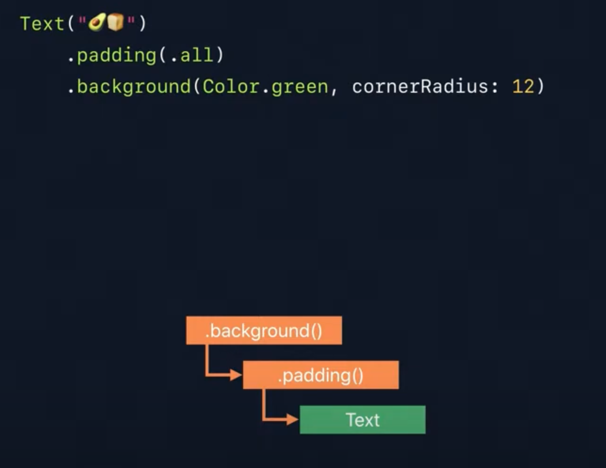
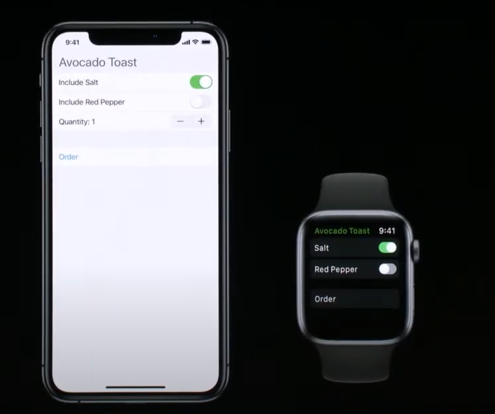

# SwiftUI Essentials

## Views and modifiers

> A view defines a piece of UI

- UIView(UIKit), NSView(AppKit)

- View Hierarchy 와 code 구조가 유사함

- SwiftUI에서는 선언형으로 UI를 정의해 addSubview 같은 메소드 사용하지 않는다.

###  Imperative Avocado Toast(명령형)
- 필요한 재료, 장비를 설명하고 이후에 만드는 방법을 알려준다.
- 1단계라도 빠뜨리면 최종 결과가 망가진다.
  

### Declarative Avocado Toast(선언형)
- 원하는 것을 설명해 결과를 만들어 내지만 다른 사람이 알아서 하도록 하는것을 포함합니다.
  - 아보카도 장인에게 아보카도 토스트를 주문하는 것과 같다.
  

### View Container Syntax
- view 들은 view builder로 불리는 closure를 통해 생성됩니다.
- view builder는 우리가 body closure 안에 선언형 코드를 작성하게 허락합니다.
  - addSubview 매서드 같은거 사용하지 않고 나열로 선언 가능ㅏㅁ

- Viewbuilder attribute 처리된 closure 파라미터인 content
  - Swift compiler는 Viewbuilder로 표시된 closure를 stack안에 있는 view들을 전부 하나의 view로 반환하는 새로운 view로 변환합니다.

- dollar sign은 control에게 binding을 전달함을 표시합니다.(not normal value)

### Binding Syntax
- Binding은 한 view가 다른 view의 상태를 편집할 수 있도록 관리되는 referece입니다.
- State attribute는 SwiftUI가 관리해주는 data dependency 입니다.

- modifier: modifier는 기존 view에서 새로운 view를 만듭니다.

- 기존 text view를 감싸는 새로운 view를 만듦
- new view는 SwiftUI에게 font 와 함께 text를 render하라고 말합니다.

- modifier 여러개 연결도 가능

- modifier를 사용하면 hierarchy가 점점 더 커지고 performance가 걱정될 수 있지만 우리는 declarative code를 작성하고 있다는 것을 기억해라 SwiftUI가 뒤에서 잘 효율적인 data structure로 만들어줍니다.

- chaining syntax

- share across views

 

### Prefer smaller, single-purpose views
> Build larger views using composition

 

## Building custom views

- View protocol을 채택한 OrderHistory struct
- previousOrders 프로퍼티
- view의 contents를 반환하는 body 연산 프로퍼티
- view builder를 통해 각 previousOrder를 기반으로 새로운 list view를 그리는 클로저

## View protocol을 채택한 OrderHistory struct
> UIKit, AppKit에서는 super class를 상속 받는 class 형태로 구성

- Custom View(OrderHistroy)는 UIView의 stored property를 상속받습니다.
- 또한, custom view에서 사용할 property도 추가됩니다.

- 공통의 view property(alpha, backgroundColor) 대신 modifier를 사용합니다.
- 이것은 그들의 목적에 맞게 view를 더 가볍게할 수 있습니다.
- 이제 공통의 저장 property를 serve(상속의 의미 같음)할 필요 없으니 protocol이 되는게 이치에 맞습니다.

### View Protocol
> **A view defines a piece of UI**

- view는 UI의 한 부분을 정의하고 더 작은 view를 compose해 더 큰 뷰를 만듭니다.
- view 계층 구조의 한 부분을 정희하고 이름을 부여해 다른 view를 구성하고 재사용할 수 있습니다.
- 

- View protocol은 view를 반환하는 body 연산 프로퍼티 정의돼있음.
- primitive view를 사용해 custom view를 구성합니다.
  - Text, Color, Spacer, Image...

- view는 명령적 event base 코드의 영속적인 객체가 아닙니다. 
- view는 inputs의 함수로 선언적으로 정의됩니다.
- view는 property가 변경될 때마다 body를 다시 호출해 view를 업데이트합니다.

- 조건문도 선언형으로 사용가능

- 서로 다른 view에게 명령을 줘 원하는대로 동작(애니메이션) 안함

- 한개의 view에 명령을 주도록 수정

- 기존 view를 더 작은 view들로 수정
- SwiftUI가 뒤에서 최적화 해주기 때문에 wrapper view(modifier)를 추가하는 것은 비용이들지 않습니다.
  - view 코드를 구성하는 방법과 performance에서 타협하지 않아도 됩니다.

 

## Composing controls

- Form은 VStack과 비슷하지만 Section을 구축하기위해 사용됩니다. 플랫폼에 상관없이 일반적이 형태를 보여줍니다.

### Button

- Control은 단순히 겉모습만 보여주는 것이 아니라 그들이 수행하는 목적이나 역할을 설명합니다.
- 다양한 상황과 플랫폼에서 재사용할 수 있습니다.

### toggle

- SwiftUI를 사용하면 시력이 손상된 사람도 voice over 기능을 통해 앱과 상호작용 가능하다.

### Picker

- Radio Style 가능

### Enviroment
- shared global state
- ancestor object에 접근해 가져와야하는 특성
- 어떤 view도 접근 가능
- 부모 view로 부터 enviroment 물려받을 수 있다.

- subview에서 environment는 override될 수 있습니다.

 

## Navigation your app

### Navigation View

- 내부적인 or 상세한 정보를 드러내는 screen으로 navigate하게 해줍니다.
- navigationBarTitle 모디파이어

- navigation link

- iPadOS, MacOS에서는 다르게 보임(split view)
