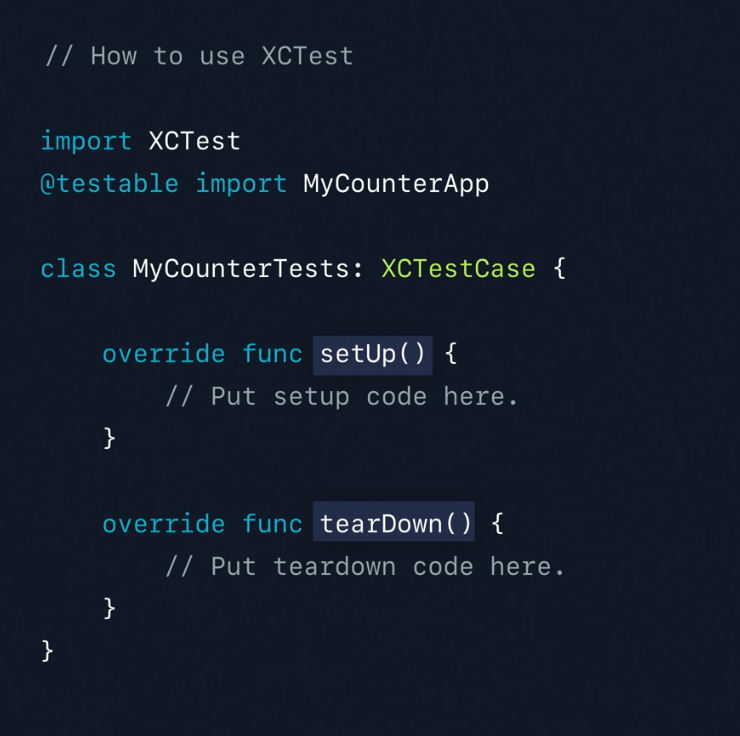

# Testing in Xcode

- Introduction to XCTest
- Test Plans
- Continuous integration workflows

## Introduction to XCTest
- Xcode 가 제공하는 자동화 테스트 프레임워크
- source code의 버그 발견을 도와줌
- 코드의 예상가능성을 보장해줌

 

### Test Pyramid

- Unit Test
  - 가장 기초에 해당하는 테스트로 작은 단위의 코드를 테스트한다.
  - 다양한 input 에 대한 예상되는 output을 검증한다.
  - 가장 짧고 수행시간이 빠르다.
  
- Integration Test
  - Unit Test 보다 큰 단위의 코드
  - 분리된 subsystem 이나 class들의 집합이 함께 구성되었을 때 정확하게 동작하는 지 확인

 

### Types of Tests in XCTest

- UI Test
  - 사용자가 App을 사용할 때 어떤 단계롤 사용할지 테스트한다.
  - 모든 동작들이 개발자가 예상한 대로 동작하는지 확인함

- Unit Test: unit test, integration test를 포함 해 소스코드를 대상으로 테스트
- UI Test: App의 시작부터 끝까지 모든 동작이 정확히 작동하는지 테스트
- Performance Test: 주어진 테스트들의 평균 수행 시간, 메모리 사용량 테스트

 

### Testing from Scratch

- XCTest import
- XCTestCase의 Subclass
- 메소드는 test로 시작해야함
- Assertion API를 사용해 테스트할 수 있다.

- setUp
  - test case가 실행되기 전에 실행됨
- tearDown
  - 변화된 data, 상태를 초기화해 하위 test들에 영향을 미치지 않게한다.

 

### Demo

#### Unit Test

- DistanceCalculator 인스턴스 생성
- DistanceCalculator 의 city 메소드 실행 (XCTUnwrap 메소드 사용해 강제 언랩핑)
- XCTAssertEqual 함수를 통해 좌표값 비교

- DistanceCalculator를 Test Case 마다 생성해야해 setUp에서 생성하도록 합니다.

- accuracy 파라미터를 사용해 정확도를 조절합니다.

- XCTAssertEqual을 사용해 error 비교

#### UI Test

- continueAfterFailure = false
  - UI Test가 실패하면 계속 진행할지 여부에 대한 Bool 값입니다.
  - UI Test가 실패했다면 예상하지 못한 UI 상태를 의미해 true로 설정해 실패시 UI Test 종료 가능
- XCUIApplication().launch()
  - UI Test가 작동하기 전 App을 실행
  

- 탭바에서 Discover 탭 tap
- San Francisco Text가 hittable 한지 테스트
- swipeLeft gesture 동작 수행
- Paris Text가 hittable 한지 테스트
- Paris 거리값 Text가 hittable 한지 테스트

 

### Test Organization

- 일반적으로 Unit Test와 UI Test 두 가지 타겟으로 분리
- Unit Test, UI Test 는 위와 같이 App에서 어떻게 동작하는지로 분기

- App, Framework, Swift Package 를 타겟으로 테스트가 필요할 수 있다.

 

### Code Coverage
- 테스트가 실행되는 동안 source code의 각 line이 몇번 실행됐는지 시각화하고 측정해줍니다.

- 빨간 부분은 테스트 수행 중 실행되지 않은 부분이고, 오른쪽 숫자는 수행된 횟수입니다. 이러한 결과를 통해 테스트 코드가 커버하지 못한 부분을 찾아 테스트 케이스를 추가할 수 있다.
