# Demystify SwiftUI

## when swiftUI looks at your code, what does it see?

- Identity: how SwiftUI recognizes elements as the same or distinct across multiple updates of your app.
- Lifetime: how SwiftUI tracks the existence of views and data over time.
- Dependencies: how SwiftUI understands when your interface needs to be updated and why.

## Identity

### Types of identity

#### Explicit identity
> using custom or data-driven identifiers.

- pointer identity
> UIkit, AppKit 에서 사용하지만 SwiftUI에서는 사용하지 않습니다.

- UIView, NSView는 class 여서 unique한 pointer를 할당받습니다. 

- SwiftUI 는 struct를 사용해 pointer identity 사용할 수 없습니다.
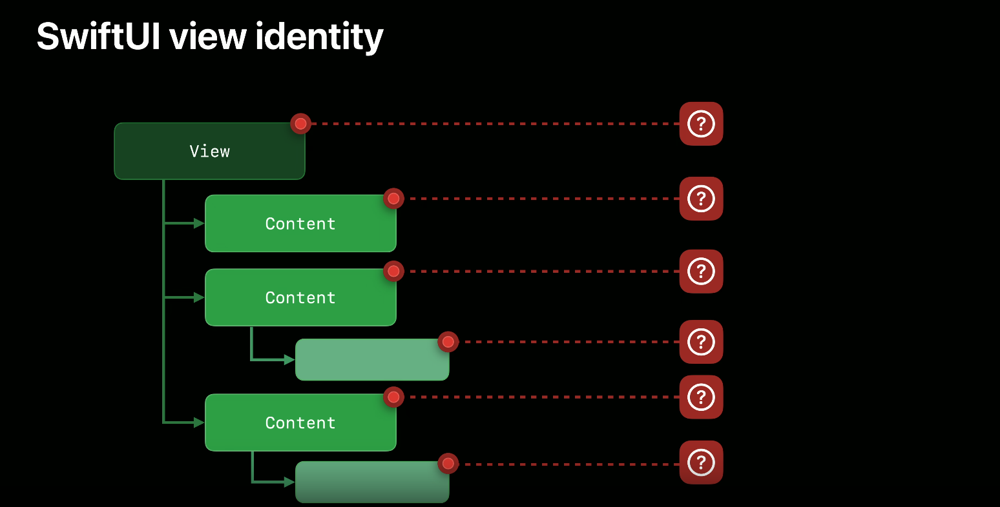

- Explicit Identity in SwiftUI

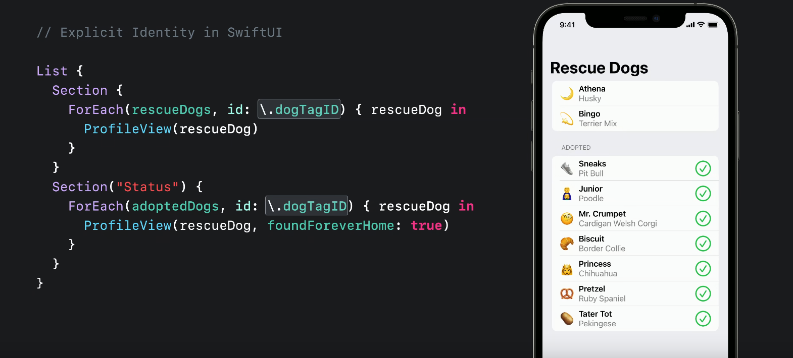

> custom ID 설정

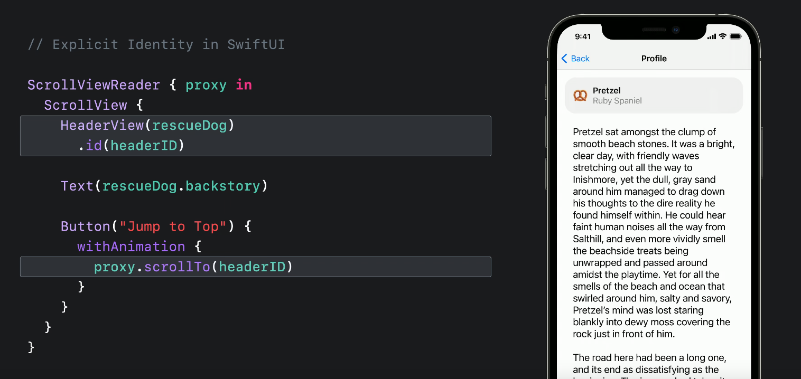

- Every view has an identity
> event if not explict identity

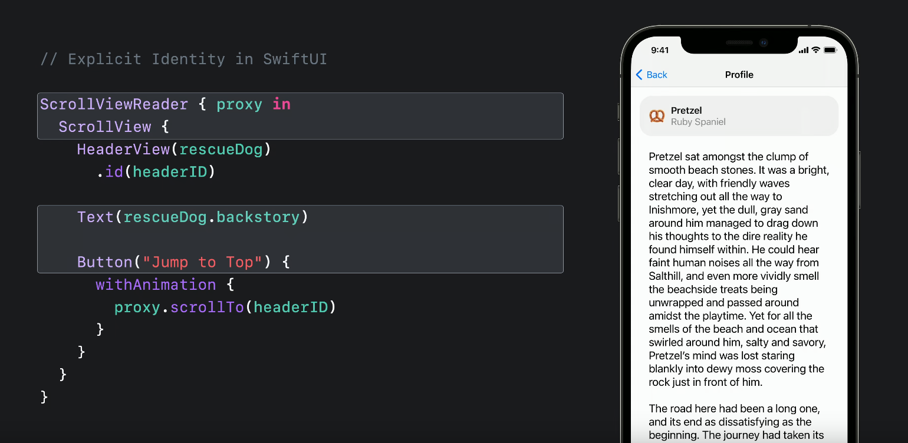
- ScrollViewReader, scrollView, Button은 explict identity가 없습니다. explict identity가 없다고 ID가 없는 것은 아닙니다.

#### Structural identity
> distinguishing views by their type and position in the view hierarchy. 

- Structural Identity in SwiftUI

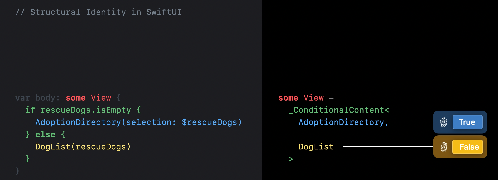
- @ViewBuilder가 _ConditionalContent<T, P>로 전환해줍니다.
- 이 Generic Type을 사용해 SwiftUI는 true, false 상황의 view를 보장해 줄 수 있습니다.

 

- 이상황에서 각각 다른 view 이므로 transition in and out 이 발생합니다. (기존 뷰가 사라지면서 새로운 뷰가 나타나는 것을 의미하는 것 같음)
  

- 상태가 변경될 때 하나의 view 이므로 부드럽게 슬라이딩해 전환됩니다.
- SwiftUI가 일반적으로 권장하는 방법입니다.
  - 기본적으로 identity를 유지하고 더 유동적인 transition을 제공하려고 노력합니다.
  - view의 life time과 state를 유지하는데도 도움이됩니다.(뒤에 더 자세히)

### AnyView
> type-erasing wrapped type

- view builder 적용
> type signature를 보면 조건문 확인 가능

- switch 적용

> switch는 syntactic sugar 이므로 type signature는 동일하다.

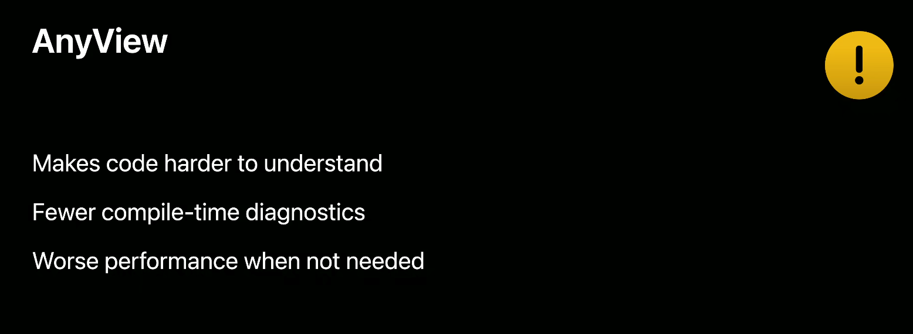
- AnyView 는 compiler로 부터 static type 정보를 숨기기 때문에 error, warnin 진단이 코드에(컴파일 오류 말하는거 같음) 표시되지 않도록합니다.

 
 

## Lifetime

### View Value != View Identity
- View Value 의 수명은 짧고 View Value의 lifetime에 의존하면 안됩니다.
- View Identity는 통제할 수 있습니다.

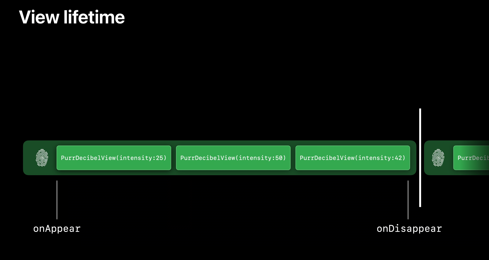
- view가 처음 생성되고 view가 나타나면 Identity에서 소개한 방법으로 view에 ID를 할당
- 시간이 지나면서 업데이트를 통해 view를 위한 새로운 값들 생성
- SwiftUI 관점에서는 같은 View임(id가 같아서 그런거같음)
- View의 ID가 변경되거나 View가 제거되면 View의 수명이 종료 됩니다.

 

### A View's lifetime is the duration of the identity
> @State, @StateObject는 view의 ID와 관련 있는 persistent storage 입니다.

- view의 ID가 처음 생성될 때 SwiftUI는 초기값을 기반으로 State 및 StateObject의 메모리에 storage를 할당합니다.
- view의 body가 변경돼도 SwiftUI는 view의 lifecycle 동안 이 storage를 유지합니다.

- 이런 방식으로 view를 구성하면 dayTime이 변할 때 마다 storage가 메모리에서 할당 / 해제를 반복

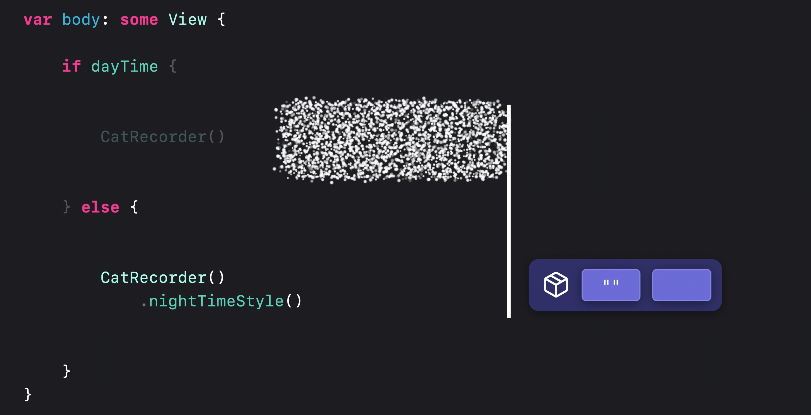

 

### State Lifetime == View Lifetime

#### Data-driven constructs
> data의 identity를 사용합니다.

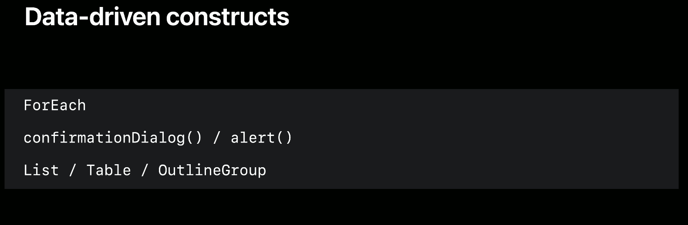

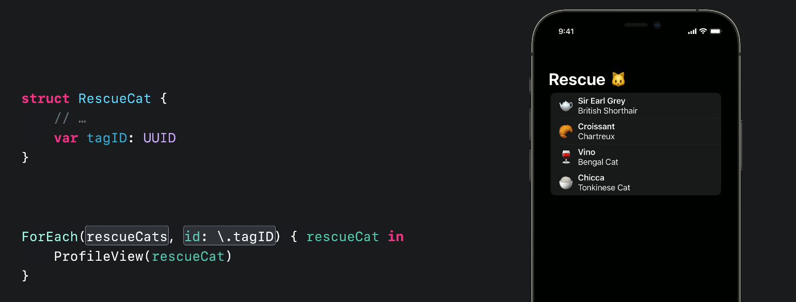
- RescueCat는 Hashable해야합니다.
- 너의 data에 안전한 identity를 제공하는 것은 Identifiable protocol을 정의하는데 매우 중요합니다.(뒤에 더 자세히..)

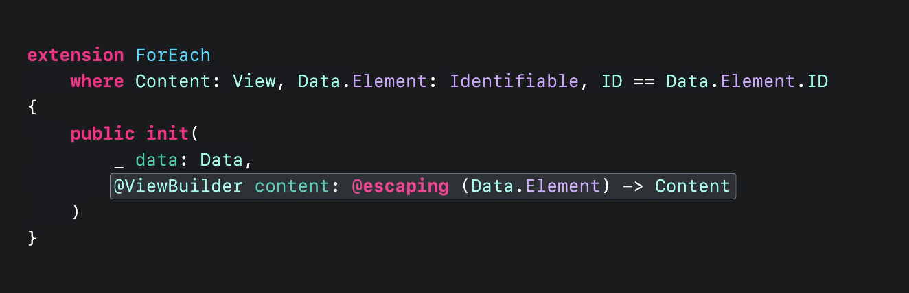

- Generic argument data
- view를 생성하는 content

크게 2부분으로 나눌 수 있다.

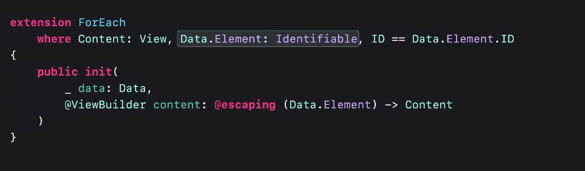
- Identifiable의 목적은 당신의 type이 안전한 identity 개념을 제공하는 것이다.

 
 

## Dependencies
> A dependency is just an input to the view.

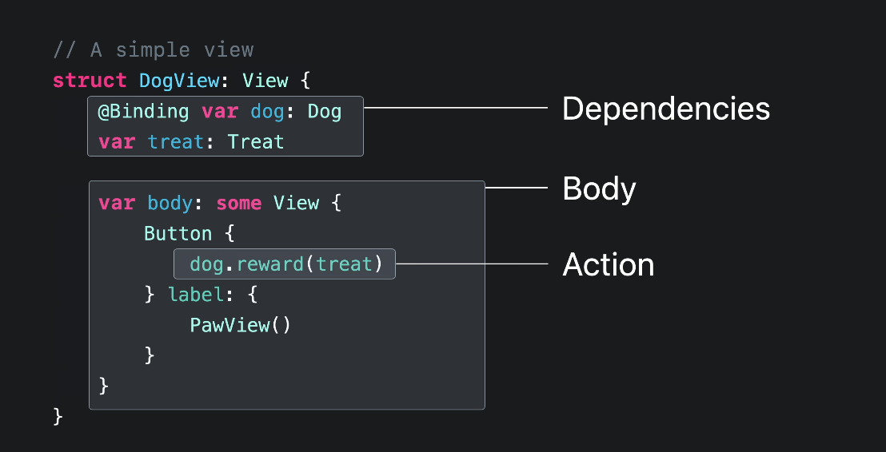
- dependency 가 변하면 view는 새로운 body를 만듭니다.
- body는 view를 위한 hierachy를 build 한는 곳입니다.
- Action은 view의 Dependency에 변화를 발생시킵니다.

### Dependency graph
- Underlying representaion of SwiftUI views
- Identity is the backbone of the graph
- Efficiently updates the UI
- Value comparision reduces body generation

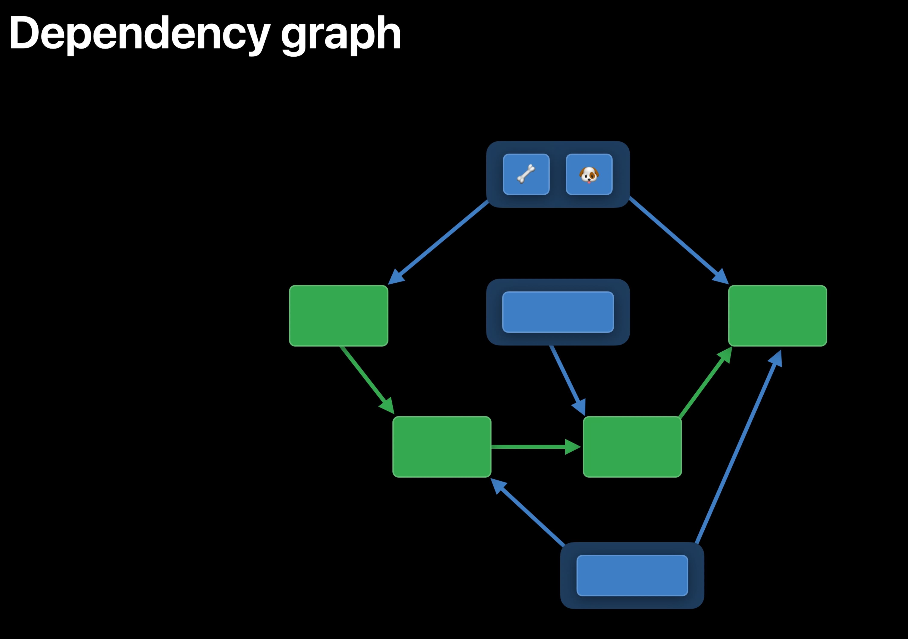
- 이 structure는 중요합니다. 이것은 SwiftUI가 새로운 body를 요구하는 view들만 효과적으로 update하도록 도와줍니다.

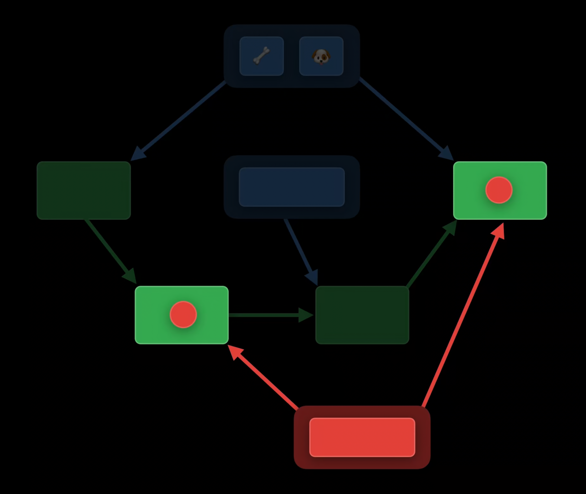
- dependency가 변하면 view 들은 무효화됩니다.
- SwiftUI는 각 view를 위한 body를 다시 생산하면서 각 view의 body를 호출합니다.
- SwiftUI는 각 무효화된 view들의 body를 instantiate화 합니다.

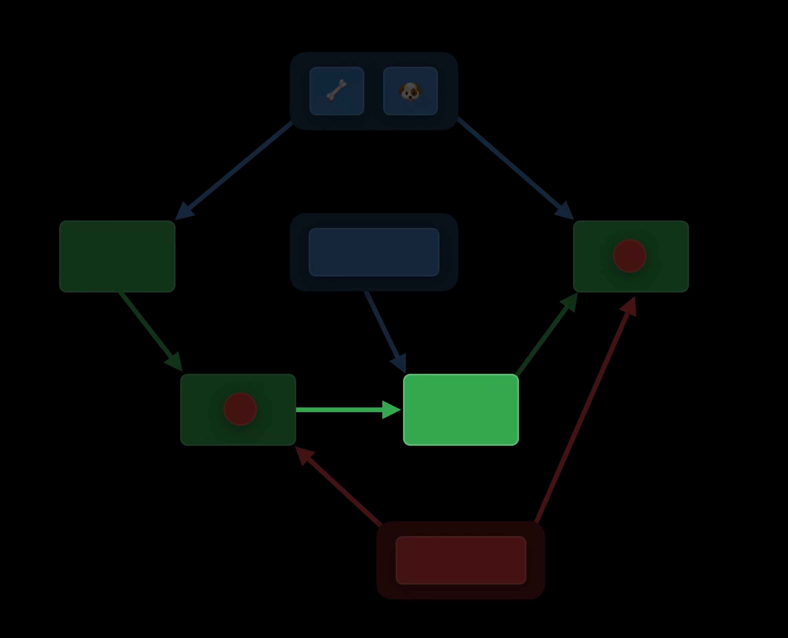
- 이것은 항상은 아니지만 더 많은 dependencies의 변화를 발생시킬 수 있습니다. 
- View는 value type이고 SwiftUI는 view의 올바른 부분만 업데이트하기위해 view들을 효과적으로 비교할 수 있습니다.
- struct value는 단지 비교를 위해사용됩니다.

 

### Kinds of dependencies

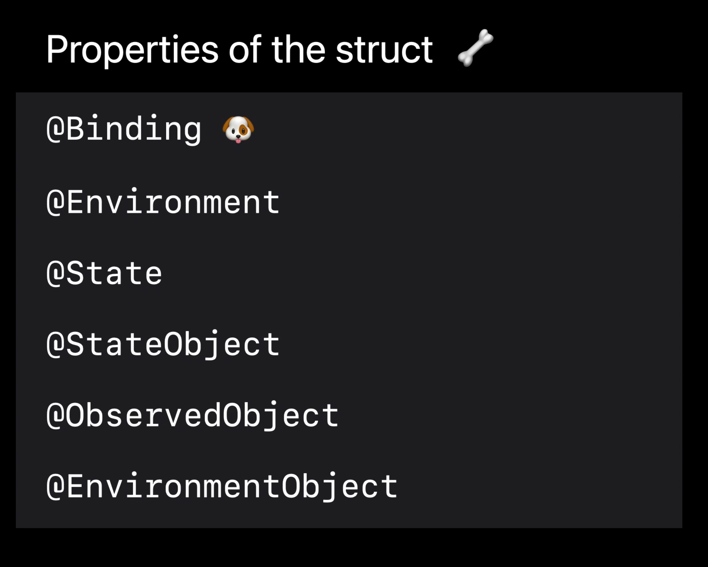

 

### Identifier Stability
- Directly impacts lifetime
  - lifetime이 짧아 질 수 있다.
- Helps performance
  -  lifetime이 짧아 지면 storage 할당 / 해제가 많아진다.
- Minimizes dependency churn
- Avoids state loss

 

- 한개만 추가해도 전체가 다시 그려지는 상황
  - 아이디가 연상 프로퍼티라 항상 달라짐
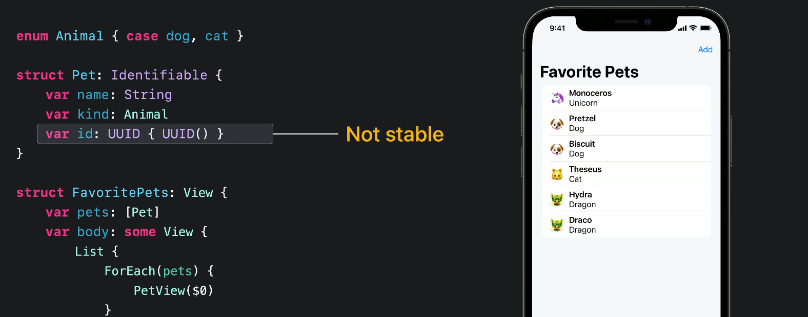

- 0번째 인덱스에 넣는데 마지막에 추가됨
  - computed random id 처럼 indices도 불안정
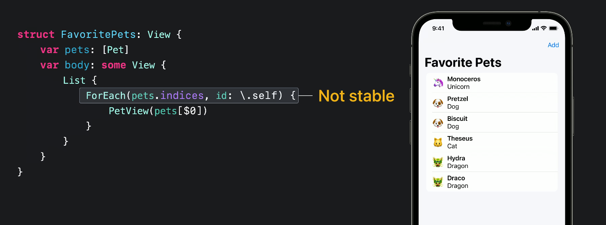
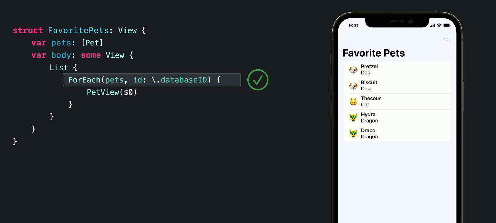

#### Identifier uniqueness
- Improve animation
- also helps performance
- correctly reflects dependencies

#### Explicit identifier
- random identifier
- stable identifiers
- ensure uniqueness identifier

#### Structural identifier
- Avoid unnecessary branches
- Tightly scope dependent code
- Prefer inert modifiers

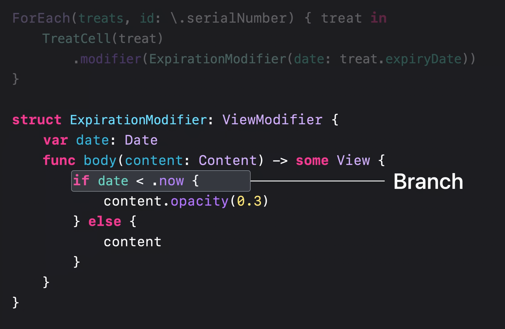
- 2개의 content를 갖음
- Branch 때문에 2개의 Structural identifier 발생

 

- branch 제거해 1개의 ID 갖게함
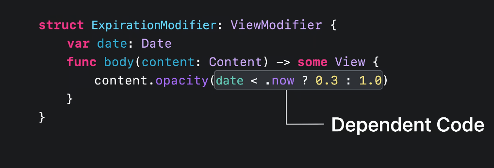

- Inert modifier
  - rendered result에 영향이 없음
  - modifier의 비용은 적어 내부적으로 거의 영향이 없다.
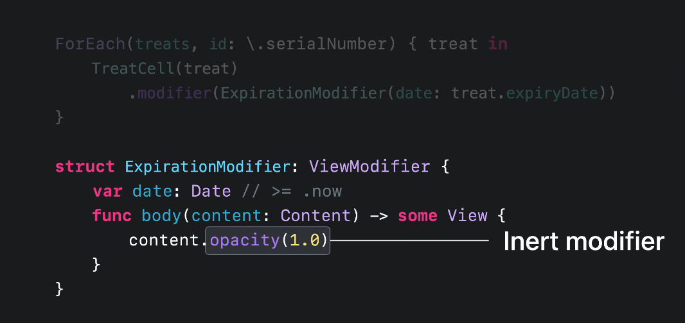