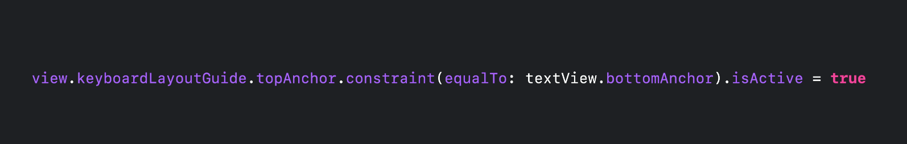
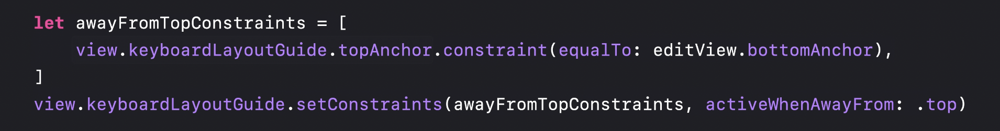
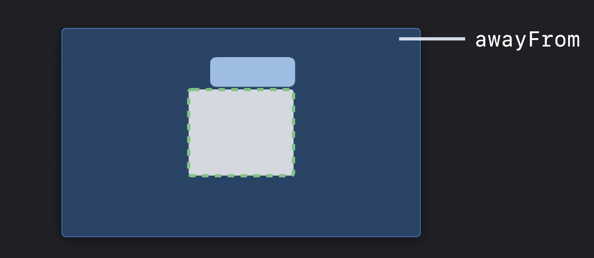

# Your guide to keyboard layout

## Layout guide

### UIKeyboarLayoutGuide

- notification을 사용했을 때

 

- 이제는 notification 사용하지 않고 코드 한 줄이면 됨
 

### Updating to keyboard layout guide 
 
- Use `view.keyboardLayoutGuide`

- Basic case: update to use .topAnchor
- Matches animations

- Follows height changes

  

- Bottom of safe area when undocked
  - 키보드가 undocked 상태일 때 guide는 safe-layout insets을 고려해 screen의 바닥으로 떨어진다.
  - width는 window의 width가 된다.

  

---

 

## Integrating the keyboard

### Avoiding "avoidance"
> UI Keyboard Layout의 핵심 동기중 하나는 사용자가 텍스트를 입력할 수 있는 다양한 방식에 대응할 수 있게 해주기 위함입니다.

- The keyboard is a part of your app
- Your layout should reflect

 

### Follow the leader

- `.followsUndockedKeyboard`
  - default는 false
- As the keyboard moves, the guide moves
  - true로 설정하면 keyboard가 undocked or floating 상태일 때 guide가 keyboard를 따라가서 keyboard가 어디에 있든지 layout이 어떻게 반응할지 대한 많은 통제권을 얻을 수 있습니다.
- No more automatic drop-to-bottom
  - 더 이상 자동으로 내려가지 않습니다.
  - undocking시 hide keyboard notification을 들을 수 없습니다.
  - layout guide는 keyboard의 위치입니다.

 

### UITrackingLayoutGuide
> UIKeyboardLayoutGuide는 UITrackingLayoutGuide의 subclass 입니다.

- A layout guide that tracks constraints that need to change
- Specify constraints activate when `near` a specific edge
- Specify constraints activate when `awayFrom` a specific edge

- awayFromTopConstraints

top edge에서 멀어질 때 edit view는 keyboard위에 붙어있음

- nearTopConstraints

top edge에 가까워질 때 edit view는 safeAreaLayoutGuide bottom에 붙어있음

- awayFromSides

- nearTrailingConstraints, nearLeadingConstraints

 

### mean of near and awayFrom 

- docked keyboard

- undocked and split keyboards

모든 edges에서 awayFrom할 수 있거나 top edge로 near할 수 있다.

- Floating

모든 edges에서 awayFrom, near 가능

2 edges에 동시에 near되는 상황에 충돌 주의!

 

---

 

## Types of keyboards

### Floating Keyboard behaviors

- Can be `awayFrom` everything

- Can be very near to top

- Set constraints when awayFrom bottom

- Can be moved any where specific

 

### Split and undocked keyboard behaviors

- 모든 edge들에서 awayFrom 가능

- Can be `near` top
- Always `awayFrom` leading/trailing
- Undocked keyboard is `awayFrom` bottom

 

### Text input via camera

- Same as docked keyboard
- Can be full screen

 

### Hardware Keyboard

- Shortcuts bar
- Width is adaptive
- Always `near` bottom

- Can be `near` leading or trailing when collapsed

### Multitasking behaviors

- Same as dismissed when out of app window  
- When narrow, `awayFrom` leading and trailing  

- Guide is sized for app window

 

## Reference

- https://developer.apple.com/videos/play/wwdc2021/10259/